# Foodie

A food ordering application built with Flutter.

## Inspiration

Link to Design on [Figma](https://www.figma.com/community/file/893381127703378146) by [Marvis Dosa](https://www.figma.com/@marvisighedosas)

## Screenshots

 

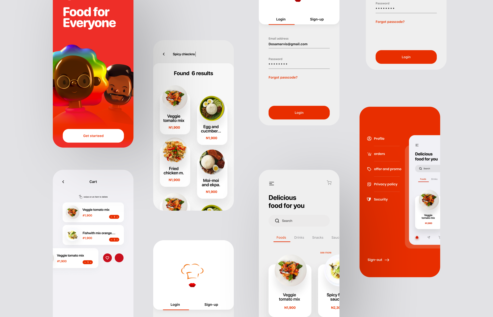

| Splash Screen | Get Started Screen | 
|    :---:     |     :---:      |  
| 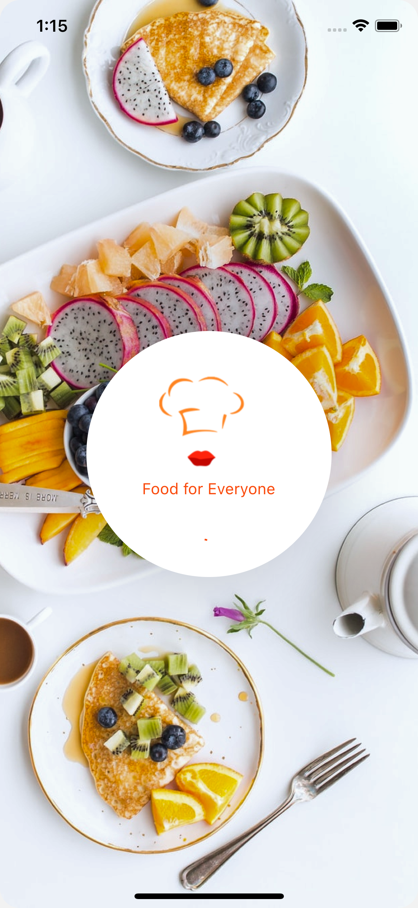   | 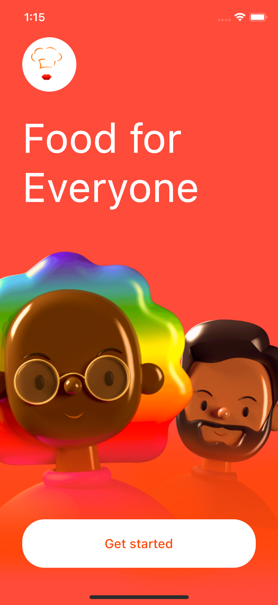   |

| Log In Screen | Sign Up Screen | 
|    :---:     |     :---:      |  
| 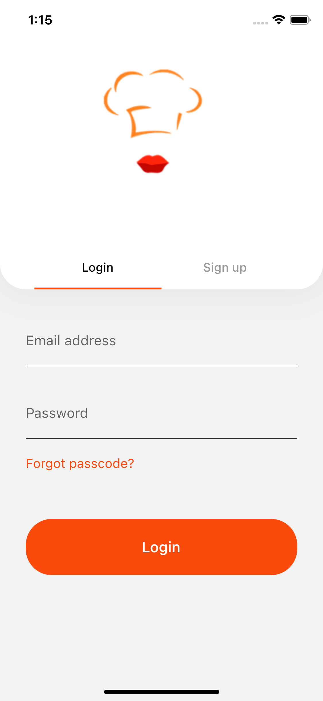   | 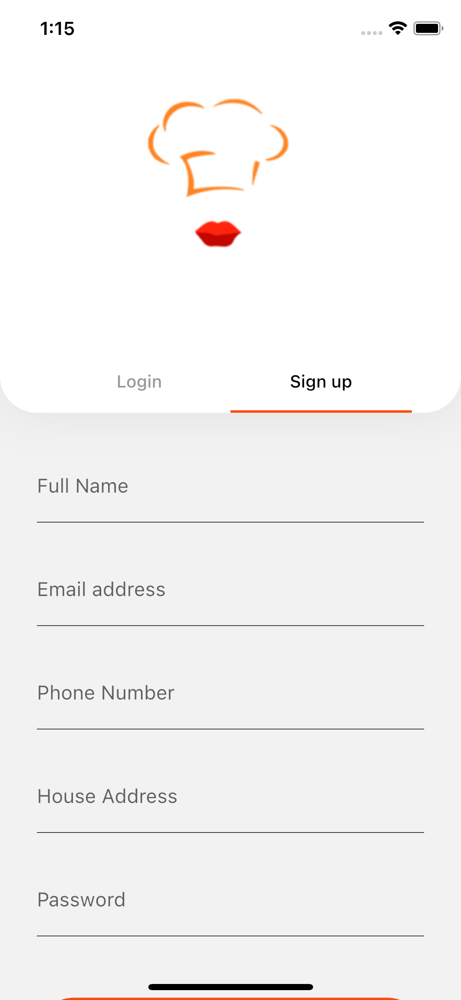   |

| Home Screen | Food Details Screen | 
|    :---:     |     :---:      |  
| 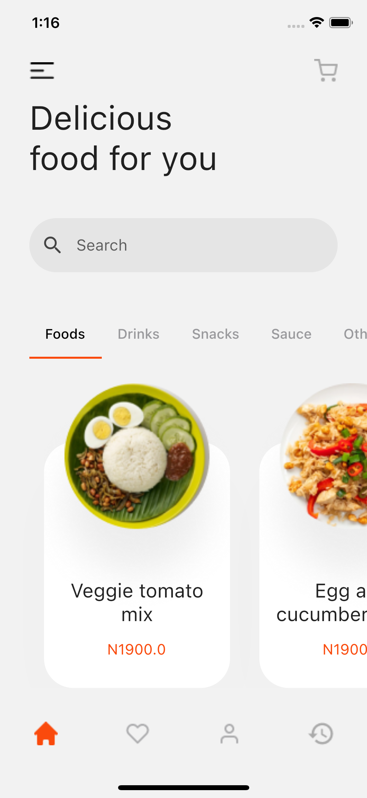   | 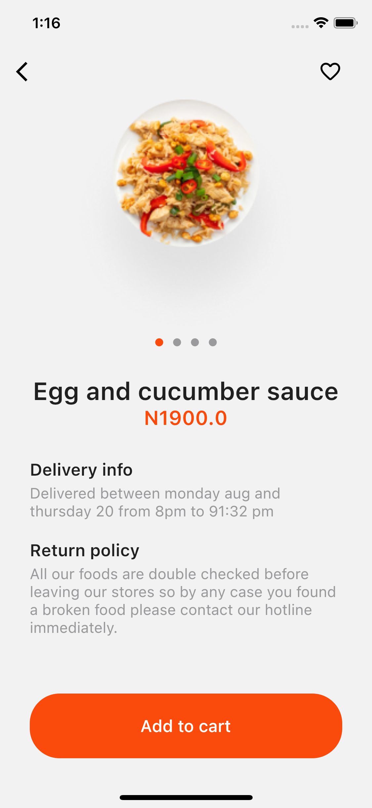   |

| Drawer Screen | Favourites Screen | 
|    :---:     |     :---:      |  
| 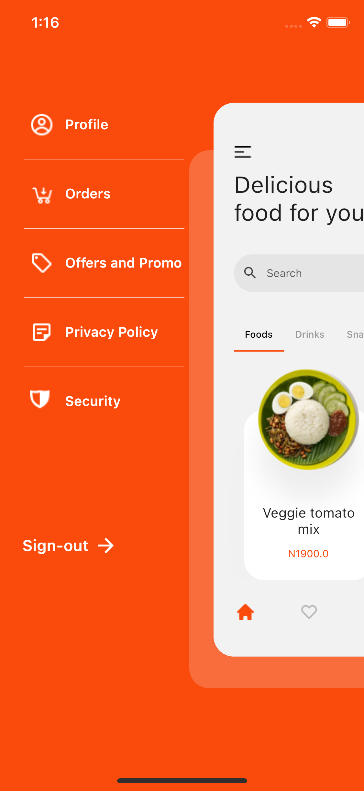   | 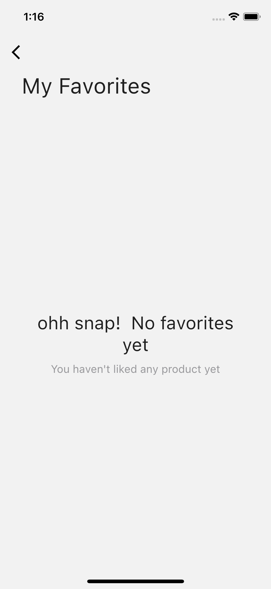   |

| Profile Screen | History Screen | 
|    :---:     |     :---:      |  
| 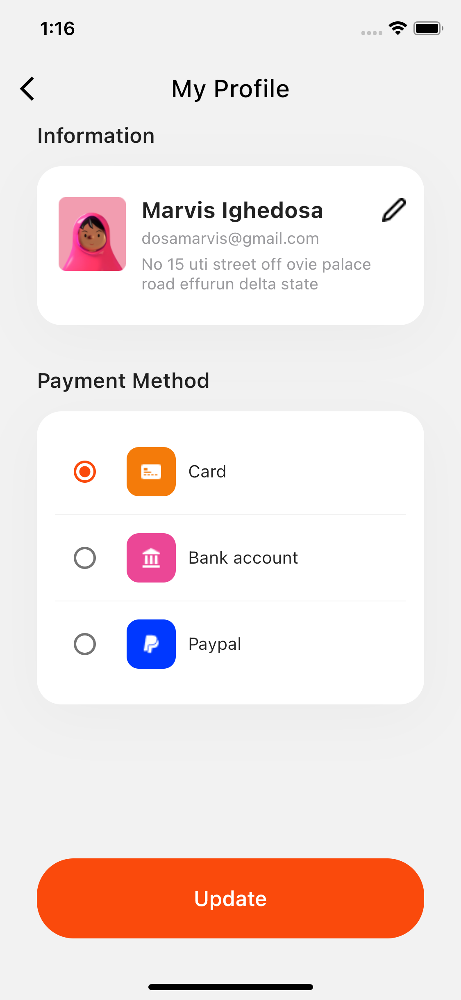   | 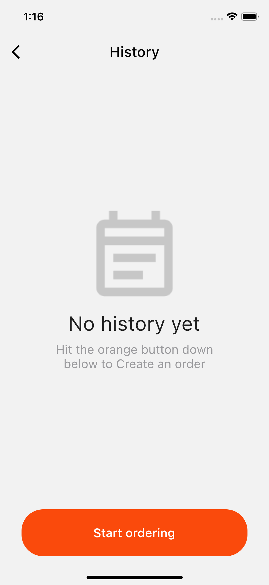   |

## Contributions

Feel free to contribute to this project.

If you find a bug or want a feature, but don't know how to fix/implement it, please fill an [issue](https://github.com/timilehinjegede/foodie/issues).
If you fixed a bug or implemented a feature, please send a [pull request](https://github.com/timilehinjegede/foodie/pulls).